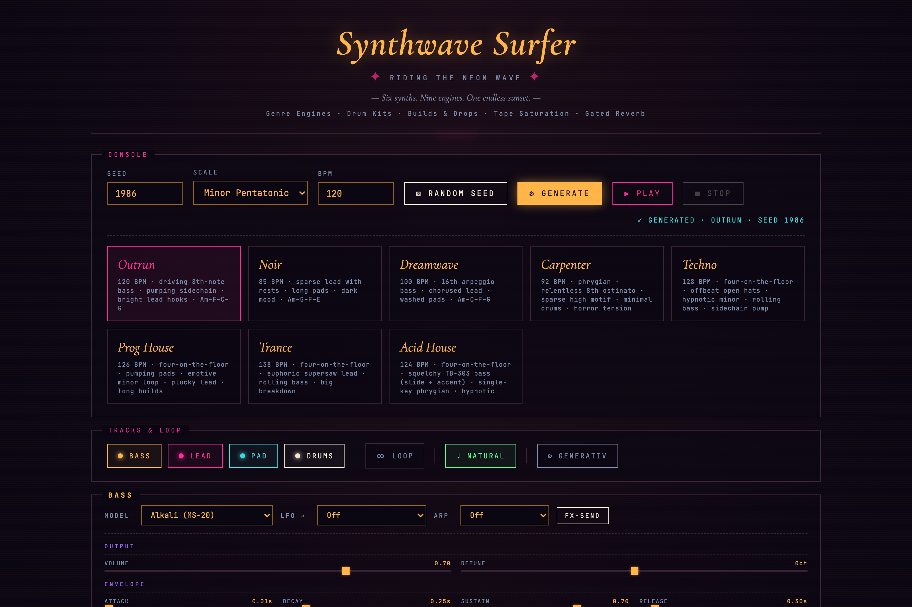

# Synthwave Surfer

> Deterministic generative synthwave in the browser — eight genre engines, one
> seed, no build step. Pick a genre, hit play, get a full arrangement.

[](LICENSE)
[](#quickstart)
[](synthwave_surfer.html)
[](https://tonejs.github.io/)
[](#browser-compatibility)

<p align="center">
  <a href="https://jkaindl.codeberg.page/synthwave-surfer/">
    
  </a>
</p>

<p align="center">
  <a href="https://jkaindl.codeberg.page/synthwave-surfer/">
    
  </a>
</p>

A single HTML file that composes and plays multi-genre electronic music in the
browser. You give it a **seed** and a **genre engine**; it deterministically
generates a complete arrangement — bass, lead, pads, drums, builds and drops —
and plays it back through [Tone.js](https://tonejs.github.io/). Same seed plus
same genre always yields the same track, so a composition is just two numbers
you can share.

It started as a way to generate **John-Carpenter-style soundtracks** for 3D
animations (the [Kuro](#roadmap) screensaver), and is on its way to becoming a
standalone Obsidian plugin — the audio layer of the Kuro universe.

## Quickstart

The app needs an **HTTP origin** to make sound — Tone.js does not initialise on
a `file://` page, so double-clicking the HTML will show the UI but stay silent.
Serve it locally:

```bash
git clone https://codeberg.org/jkaindl/synthwave-surfer.git
cd synthwave-surfer
python3 -m http.server 8745
# → open http://localhost:8745/synthwave_surfer.html
```

Or just use the hosted build: **[jkaindl.codeberg.page/synthwave-surfer](https://jkaindl.codeberg.page/synthwave-surfer/)**.

Then: click a **genre card**, press **Generate**, hit **▶ Play**. Change the
seed for a different composition in the same style; tweak any slider to re-voice
it live.

## What it does

- **Eight genre engines**, each with its own composition algorithm *and* its own
  synth voicing — Outrun, Noir, Dreamwave, Carpenter, Techno, Prog House, Trance,
  Acid House (see the [genre table](#genres)). A ninth, Dubstep, is parked.
- **Deterministic** — `seed + genre` fully determines the output. Reproducible,
  shareable, diff-able. No two seeds sound alike; the same seed never drifts.
- **Motif-based composition** — a melody engine that states a motif and develops
  it (transpose / invert / ornament) instead of random-walking, plus a
  root-anchored bass-riff engine with turnaround fills.
- **Six synth voices**, shared across the engines — a DX7-style FM bell, an
  MS-20 distorted bass, a TB-303 (saw + resonant filter envelope + Chebyshev
  squelch), two Juno-106-style detuned-saw voices (a washed pad and a brighter
  lead), and a 7-oscillator supersaw anthem lead.
- **Four classic drum kits** — LinnDrum-style gated, TR-909, TR-808, and a heavy
  Dubstep kit — with **live per-voice knobs** (kick decay/boom, snare whip/tone,
  hat decay, gated-snare toggle).
- **EDM arrangement engine** — a 32-bar form with two drops and a breakdown,
  noise risers and crashes into each drop, and a pre-drop kick cut so the drop
  *slams*.
- **Real-time editing** — per-track instrument panels (model, ADSR, filter, LFO)
  and a master FX bus (reverb, feedback delay, sidechain, tape saturation).
- **Export** — MIDI (all tracks), `.swmd` (a [Markdown music format](#the-swmd-format)
  that opens in Obsidian), WAV (offline render), and full state as JSON.
- **Presets** — every genre card *is* a curated preset; save your own tweaks to
  `localStorage` and export/import them as JSON.
- **External API** — a small frozen `window.synthwaveSurfer` for driving phase
  changes from outside (e.g. syncing an animation to the music).
- **Zero build, one dependency** — a single ~3.9k-line HTML file; Tone.js loads
  from a CDN. Nothing to install, nothing to compile.

## Genres

Each genre is both a *composition engine* (the notes and structure) and a
*voicing* (the sound). Clicking a card loads its curated seed, BPM, scale, drum
kit, and voicing in one go.

| Genre | Character | BPM | Key | Seed |
|-------|-----------|----:|-----|-----:|
| **Outrun** | Driving 8th-note bass, pumping sidechain, bright lead hooks | 120 | A minor pentatonic | 1986 |
| **Noir** | Sparse *Blade Runner* atmosphere, sustained Vangelis-style leads, no sidechain | 85 | A aeolian | 2019 |
| **Dreamwave** | 16th-note arpeggio bass, shuffled hats, washed pads | 100 | A aeolian | 1985 |
| **Carpenter** | Relentless phrygian ostinato, continuous "Halloween" arp, no hats | 92 | A phrygian | 1978 |
| **Techno** | Four-on-the-floor, offbeat open hats, two drops + breakdown | 128 | A aeolian | 808 |
| **Prog House** | Four-on-the-floor, supersaw plucks, pumping pads | 126 | A aeolian | 909 |
| **Trance** | Euphoric supersaw anthem leads, full 32-bar arrangement | 138 | A aeolian | 138 |
| **Acid House** | TB-303 squelch line (per-step slide + accent), hypnotic single key | 124 | A phrygian | 303 |

> A ninth engine, **Dubstep**, is currently **parked** (hidden from the selector)
> — its wobble needs per-bar bass-filter modulation that isn't wired yet. The
> code is still in the repo; see the [roadmap](#roadmap).

The seeds are deliberate flavour, not arbitrary: birth years of the style
(Outrun `1986`, *Halloween* `1978`), Roland model numbers (`808`, `909`, TB-`303`),
and signature tempos (Trance `138`).

## Usage

Full reference of every control: **[docs/USAGE.md](docs/USAGE.md)**.

The essentials:

| Element | Function |
|---------|----------|
| **Genre cards** | Load a genre's preset (seed, BPM, scale, drum kit, voicing) and regenerate |
| **Seed / Scale / BPM** | The composition inputs — change any, then **Generate** |
| **▶ Play / ⏹ Stop / Loop** | Transport |
| **Tracks & Loop** | Per-track mute (bass/lead/pad/drums), loop, harmonic mode |
| **Instrument panels** | Live model + ADSR + filter + LFO per track |
| **Drums · Kit & Voicing** | Drum-kit selector + live per-voice knobs + snare-gate toggle |
| **Master · FX & Bus** | Reverb, delay, sidechain, tape saturation, master gain |
| **Export** | WAV · MIDI · `.swmd` · State JSON |

## The .swmd format

`.swmd` is a **Markdown** music format — a human-readable, Obsidian-compatible
serialisation of a composition. It stores YAML frontmatter (genre, BPM, mode),
one block per phase with per-track settings, note patterns as piano-roll tables,
drum grids as fenced ` ```swdrum ` blocks, and an FX-bus table. Files are written
with a `.md` extension so they render natively in Obsidian, and the importer
accepts both `.swmd` and `.md`. It is the didactic bridge format between the
generator and the planned Obsidian plugin. See
[docs/ARCHITECTURE.md](docs/ARCHITECTURE.md#the-swmd-codec) for the schema.

## Architecture in one picture

```
 seed + genre
      │
      ├── ALGORITHMS[genre]  ──►  composition: form · bass · lead · pad ·
      │   (what notes/structure)  drums · swing · sidechain · arrangement
      │
      └── ENGINE_VOICINGS[genre] ─►  voicing: synth model + ADSR + filter +
          (what it sounds like)      LFO per track · master FX (mergeVoicing)
                       │
                       ▼
                  generate()  ──►  currentState.form  (note events)
                       │
                       ▼
              Tone.Transport schedules parts
                       │
   per-track bus ──► dry ─┐         drum voices ─┐
   (vol·sidechain·LFO)    ├─► compressor ─► tape sat ─► limiter ─► master ─► out
            └─► sends ─► reverb / delay ─┘
```

Engine (composition) and voicing (sound) are deliberately decoupled, so a
genre's algorithm and its tone evolve independently. Full technical docs —
synth models, drum-kit graph, arrangement engine, the `.swmd` codec, the
public API — are in **[docs/ARCHITECTURE.md](docs/ARCHITECTURE.md)**.

## Browser compatibility

Needs the Web Audio API and a modern evergreen browser. Audio starts only after
a user gesture (click / key), per browser autoplay policy.

| Browser | Status |
|---------|--------|
| Chrome / Edge (Chromium) ≥ 90 | ✅ full |
| Firefox ≥ 90 | ✅ full |
| Safari ≥ 14 | ✅ full (first interaction unlocks audio) |
| Mobile Safari / Chrome Mobile | ✅ plays; the dense desktop UI is cramped on small screens |

In all cases the page must be served over **HTTP/HTTPS**, not opened from
`file://` (Tone.js will not initialise otherwise).

## Project layout

```
.
├── synthwave_surfer.html   # the entire app (UI + engines + voicings + audio graph + tests)
├── index.html              # redirect to synthwave_surfer.html (for the hosted root URL)
├── assets/                 # README images
├── scripts/                # headless test runners (check-syntax, fullsuite)
├── docs/
│   ├── ARCHITECTURE.md     # how the engines, audio graph, .swmd codec, and API work
│   ├── USAGE.md            # full user guide
│   └── superpowers/        # internal design specs / plans / research (process docs)
├── LICENSE                 # AGPL-3.0-or-later
├── LICENSING.md            # dual-licensing model (AGPL + optional commercial)
├── CLA.md                  # contributor license agreement
├── CONTRIBUTING.md         # developer workflow + test procedures
├── CHANGELOG.md            # Keep a Changelog
├── SECURITY.md             # threat model + reporting
├── .editorconfig
└── AGENTS.md               # orientation for AI assistants (humans can skip it)
```

## Testing

No build, three test layers (details in [CONTRIBUTING.md](CONTRIBUTING.md)):

```bash
node scripts/check-syntax.mjs           # 1. syntax gate (parses the inline <script>)
node scripts/fullsuite.mjs              # 2. headless logic suite → real: 47 passed, 0 failed
# 3. in-browser: open http://localhost:8745/synthwave_surfer.html?test=1  (51 tests → console)
```

A Playwright + headless-Chrome audio harness (measuring master-output RMS) is
used to verify that engines actually produce sound, not just that the logic
passes.

## Contributing

Issues and PRs welcome — developer quickstart in **[CONTRIBUTING.md](CONTRIBUTING.md)**.
Security-relevant reports: please don't file them publicly, see
**[SECURITY.md](SECURITY.md)**. AI assistants get their orientation in
**[AGENTS.md](AGENTS.md)**.

## Roadmap

Synthwave Surfer is the **audio layer of the Kuro universe** — a theme, a
companion plugin, and this generator forming one Obsidian ecosystem.

Shipped:

- [x] Multi-genre engines with decoupled composition + voicing
- [x] Motif-based melody engine and bass-riff engine
- [x] Selectable drum kits with live per-voice editing
- [x] EDM arrangement engine (builds, drops, breakdown, risers)
- [x] `.swmd` Markdown codec (import / export)

Capability-layer expansion (in progress):

- [ ] **Dubstep wobble** — per-bar bass-filter modulation via a dedicated filter
  node in the bass bus (the bus LFO can't reach the PolySynth's per-voice filter);
  Dubstep is parked until then.

- [ ] **Layer B** — extended jazz voicings for Lo-fi / DnB, per-track
  swing + humanisation, lo-fi texture (crackle / bitcrush)
- [ ] More genres riding the existing layers (Chillstep, Lo-fi, DnB)
- [ ] **Tier 3 — Bach**: a polyphonic counterpoint engine with functional
  voice-leading (the genuinely hard generative problem; not note-for-note Bach)

Beyond the generator:

- [ ] **Obsidian plugin** (TypeScript port + `swdrum` renderer) — also resolves
  the `file://` limitation
- [ ] **Kuro integration** — drive soundtracks from companion-plugin events

## License

Synthwave Surfer is **dual-licensed** — see [LICENSING.md](LICENSING.md) for the
full picture:

- **Open source (default):** [GNU AGPL-3.0-or-later](LICENSE) — copyleft with the
  network-use clause. If you host the tool (or a fork) so others can use it over
  a network, your variant's source must also be available under the AGPL.
- **Commercial license (on request):** for uses the AGPL does not fit — e.g. a
  proprietary product or an Apple App Store build. Details in
  [LICENSING.md](LICENSING.md); contributions are governed by the [CLA](CLA.md).

[Tone.js](https://tonejs.github.io/) is © its authors, MIT-licensed, loaded from
a CDN and not redistributed here.
