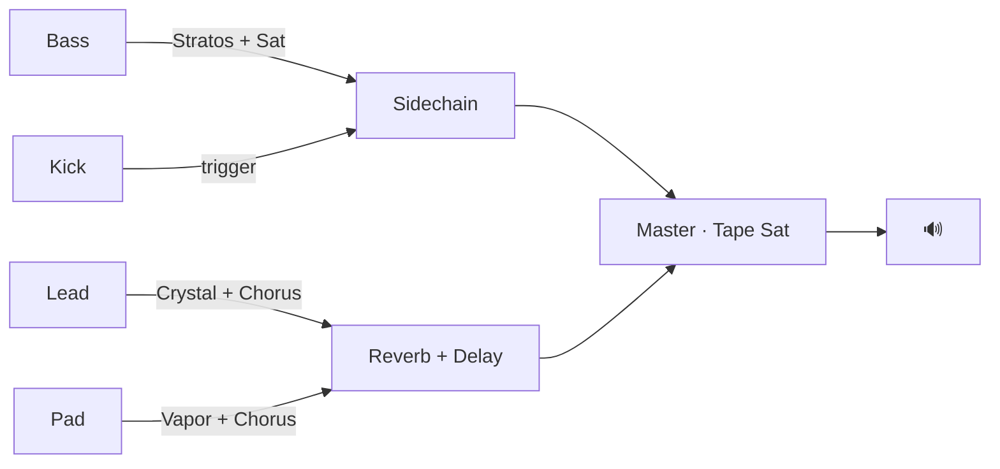

# Synthwave Markdown (.swmd) Codec + Fixed Patterns Implementation Plan

> **For agentic workers:** REQUIRED SUB-SKILL: Use superpowers:subagent-driven-development (recommended) or superpowers:executing-plans to implement this plan task-by-task. Steps use checkbox (`- [ ]`) syntax for tracking.

**Goal:** Add a human-editable `.swmd` (Synthwave Markdown) format for exporting/importing song patterns, embed curated hand-composed patterns into each factory preset, and fix WAV export.

**Architecture:** All code lives in `synthwave_surfer.html` (single-file app). The `.swmd` codec (serializer + parser) sits between the UI and `generate()`. When `patternMode === 'fixed'`, `generate()` uses a parsed fixed pattern instead of calling the generative algorithms. Factory presets embed their fixed pattern as a template-literal `.swmd` string.

**Tech Stack:** Vanilla JS, Tone.js 14, single HTML file. No build step.

---

## File Structure

Only one file: `synthwave_surfer.html`

New JS functions to add (in order, ~line 640 after the Form builders section):
- `swmdSerialize(state, trackParams, masterState)` → `.swmd` string
- `swmdParse(text)` → `{ meta, bassPattern, leadPattern, padChords, drumGrid, bassSettings, leadSettings, padSettings, fxSettings }`
- `serializePianoRoll(notes, scaleLen)` → markdown table string
- `parsePianoRoll(tableText, scaleLen)` → `{degree, duration}[]`
- `serializeDrums(drumGrid)` → swdrum block string
- `parseDrums(swdrumText)` → `{ kick, snare, hihat, open }` (each: boolean[16])
- `exportSwmd()` — button handler
- `importSwmd(file)` — button handler
- `buildFormFromSwmd(parsed, algo, scale)` — builds `form` object from parsed `.swmd`

New state: `let patternMode = 'generative';` and `let currentSwmd = null;`

UI additions:
- Export panel: `⬇ SWMD` + `⬆ SWMD` buttons
- Tracks panel: `⚙ Generativ / ⚙ Fixed` pattern mode toggle

---

## `.swmd` Format Reference

```
---
synthwave-surfer: "1.0"
name: Miami Nights
algo: outrun
bpm: 120
mode: aeolian
pattern-mode: fixed
bass-root: 48
lead-root: 60
---

## Bass · Stratos

### Settings
| Param     | Value |
|-----------|-------|
| model     | stratos |
| volume    | 0.70  |
| character | 0.50  |
| lfoTarget | pwm   |

### Pattern
| Grad |  1 |  2 |  3 |  4 |  5 |  6 |  7 |  8 |  9 | 10 | 11 | 12 | 13 | 14 | 15 | 16 |
|------|----|----|----|----|----|----|----|----|----|----|----|----|----|----|----|----|
|  4   |    |    |    |    |    |    |    |    |    |    |    |    |    |    |  ● |    |
|  2   |    |    |    |    |  ● |    |    |    |    |    |  ● |    |    |    |    |    |
|  0   |  ● |  ─ |    |    |    |    |  ● |  ─ |  ● |  ─ |    |    |  ● |  ─ |    |  ─ |

## Lead · Crystal

### Settings
| Param  | Value |
|--------|-------|
| model  | crystal |
| volume | 0.45  |
| send   | true  |

### Pattern
| Grad |  1 |  2 |  3 |  4 |  5 |  6 |  7 |  8 |  9 | 10 | 11 | 12 | 13 | 14 | 15 | 16 |
|------|----|----|----|----|----|----|----|----|----|----|----|----|----|----|----|----|
|  6   |    |    |    |    |    |    |  ● |  ─ |    |    |    |    |    |    |    |    |
|  4   |  ● |  ─ |  ─ |  ─ |    |    |    |    |  ● |  ─ |  ─ |    |    |    |    |    |
|  2   |    |    |    |    |  ● |  ─ |    |    |    |    |    |    |  ● |  ─ |  ─ |  ─ |

## Pad · Vapor

### Settings
| Param  | Value |
|--------|-------|
| model  | vapor |
| volume | 0.40  |
| send   | true  |

### Progression
| Bar    |   1  |   2  |   3  |   4  |
|--------|------|------|------|------|
| Degrees | 0,2,4 | -2,0,2 | 2,4,6 | -1,1,3 |

## Drums

### Pattern
```swdrum
kick:  x . . . x . . . x . . . x . . .
snare: . . . . x . . . . . . . x . . .
hihat: x . x . x . x . x . x . x . x .
open:  . . . . . . . x . . . . . . . x
```

## FX Bus
| Effect    | Param     | Value |
|-----------|-----------|-------|
| reverb    | size      | 0.60  |
| reverb    | wet       | 0.50  |
| delay     | time      | 0.55  |
| delay     | feedback  | 0.45  |
| delay     | wet       | 0.45  |
| sidechain | depth     | 0.75  |
| tapeSat   | drive     | 0.35  |
| master    | gain      | 0.80  |

## Routing

```

---

## Key Design Decisions

**Root notes:** To harmonize all tracks, fixed presets use `bass-root: 48` (C3) and `lead-root: 60` (C4). The pad already uses root=60 (C4) with aeolian. All patterns use aeolian degrees so everything plays in C minor.

**Piano roll encoding:**
- `●` = note ON (start of a new note at this degree)
- `─` = note HOLD (continuation of previous note in this row)
- ` ` = rest / silence
- Only one row can be active per step column (monophonic)
- Duration = count of consecutive (● + ─) cells
- Rows are sorted highest degree to lowest (top = high pitch)

**Drum grid:** 16 steps per bar, `x` = hit, `.` = rest, space-separated.

**Pattern loop:** Bass pattern loops every bar. Lead pattern loops every 4 bars (= 64 steps). Pad progression loops every 4 bars.

---

## Task 1: YAML frontmatter parser (lightweight, no dependency)

**Files:** Modify `synthwave_surfer.html` — add after the `buildChordMap` function (~line 490)

- [ ] **1.1 Add `parseYamlFrontmatter(text)`**

```javascript
function parseYamlFrontmatter(text) {
  const match = text.match(/^---\n([\s\S]+?)\n---/);
  if (!match) return {};
  const result = {};
  for (const line of match[1].split('\n')) {
    const m = line.match(/^([\w-]+):\s*"?([^"]*)"?\s*$/);
    if (m) result[m[1]] = m[2].trim();
  }
  return result;
}
```

- [ ] **1.2 Add `splitSwmdSections(text)`**

```javascript
function splitSwmdSections(text) {
  const sections = {};
  const parts = text.split(/\n## /);
  for (let i = 1; i < parts.length; i++) {
    const nl = parts[i].indexOf('\n');
    const header = parts[i].slice(0, nl).trim();
    const key = header.split(' ·')[0].trim();
    sections[key] = parts[i].slice(nl + 1);
  }
  return sections;
}
```

- [ ] **1.3 Add `parseMarkdownTable(text)` — returns array of row-objects**

```javascript
function parseMarkdownTable(text) {
  const lines = text.split('\n').filter(l => l.trim().startsWith('|'));
  if (lines.length < 2) return [];
  const headers = lines[0].split('|').slice(1, -1).map(h => h.trim());
  const rows = [];
  for (let i = 2; i < lines.length; i++) {
    const cells = lines[i].split('|').slice(1, -1).map(c => c.trim());
    const row = {};
    headers.forEach((h, j) => { row[h] = cells[j] ?? ''; });
    rows.push(row);
  }
  return rows;
}
```

---

## Task 2: Piano roll parser + serializer

**Files:** Modify `synthwave_surfer.html` — add after Task 1 functions

- [ ] **2.1 Add `parsePianoRoll(sectionText)` → `{degree, duration}[]`**

```javascript
function parsePianoRoll(sectionText) {
  // Find ### Pattern subsection
  const patternMatch = sectionText.match(/### Pattern\n([\s\S]+?)(?=\n###|\n##|$)/);
  if (!patternMatch) return [];
  const tableText = patternMatch[1];
  const lines = tableText.split('\n').filter(l => l.trim().startsWith('|'));
  if (lines.length < 3) return [];

  const stepCount = lines[0].split('|').length - 2; // exclude first (degree) and last empty
  // Build grid: stepGrid[step] = degree or null
  const stepGrid = new Array(stepCount).fill(null);

  for (let r = 2; r < lines.length; r++) {
    const cells = lines[r].split('|').slice(1, -1);
    const degree = parseInt(cells[0].trim());
    for (let s = 0; s < stepCount; s++) {
      const cell = (cells[s + 1] || '').trim();
      if (cell === '●') stepGrid[s] = { degree, starting: true };
      else if (cell === '─' && stepGrid[s] === null) stepGrid[s] = { degree, starting: false };
    }
  }

  const notes = [];
  let i = 0;
  while (i < stepGrid.length) {
    if (!stepGrid[i]) { notes.push({ rest: true, duration: 1 }); i++; continue; }
    const degree = stepGrid[i].degree;
    let dur = 1;
    while (i + dur < stepGrid.length && stepGrid[i + dur] && !stepGrid[i + dur].starting && stepGrid[i + dur].degree === degree) dur++;
    notes.push({ degree, duration: dur }); i += dur;
  }
  // Merge consecutive rests
  const merged = [];
  for (const n of notes) {
    if (n.rest && merged.length && merged[merged.length - 1].rest) merged[merged.length - 1].duration += n.duration;
    else merged.push({ ...n });
  }
  return merged;
}
```

- [ ] **2.2 Add `serializePianoRoll(notes)` → markdown table string**

```javascript
function serializePianoRoll(notes) {
  const steps = [];
  for (const n of notes) {
    if (n.rest) { for (let i = 0; i < n.duration; i++) steps.push(null); continue; }
    steps.push({ degree: n.degree, start: true });
    for (let i = 1; i < n.duration; i++) steps.push({ degree: n.degree, start: false });
  }
  const S = steps.length;
  const degrees = [...new Set(steps.filter(Boolean).map(s => s.degree))].sort((a, b) => b - a);
  if (degrees.length === 0) return '';
  const minD = Math.min(...degrees) - 1, maxD = Math.max(...degrees) + 1;
  const allDegrees = [];
  for (let d = maxD; d >= minD; d--) allDegrees.push(d);

  const colW = 3;
  const gradW = 6;
  const header = `| ${'Grad'.padEnd(gradW)} |` + Array.from({ length: S }, (_, i) => ` ${String(i + 1).padStart(2)} `).join('|') + '|';
  const sep = `|${'-'.repeat(gradW + 2)}|` + Array.from({ length: S }, () => `${'-'.repeat(colW + 1)}-`).join('|') + '|';
  const rows = allDegrees.map(d => {
    const cells = steps.map(s => {
      if (!s || s.degree !== d) return '   ';
      return s.start ? ' ● ' : ' ─ ';
    });
    return `| ${String(d).padStart(gradW)} |` + cells.join('|') + '|';
  });
  return [header, sep, ...rows].join('\n');
}
```

---

## Task 3: Drum parser + serializer

**Files:** Modify `synthwave_surfer.html` — add after Task 2

- [ ] **3.1 Add `parseDrums(sectionText)` → `{ kick, snare, hihat, open }` (each: boolean[16])**

```javascript
function parseDrums(sectionText) {
  const blockMatch = sectionText.match(/```swdrum\n([\s\S]+?)```/);
  if (!blockMatch) return null;
  const result = { kick: [], snare: [], hihat: [], open: [] };
  for (const line of blockMatch[1].split('\n')) {
    const m = line.match(/^(\w+):\s*(.+)$/);
    if (!m) continue;
    const key = m[1].toLowerCase();
    if (!(key in result)) continue;
    result[key] = m[2].trim().split(/\s+/).map(c => c === 'x');
  }
  // Pad missing keys to 16 steps
  for (const k of Object.keys(result)) {
    while (result[k].length < 16) result[k].push(false);
  }
  return result;
}
```

- [ ] **3.2 Add `serializeDrums(algo)` → swdrum block string**

```javascript
function serializeDrums(algo) {
  // Build a representative 1-bar drum grid from algo.drumPattern
  const K = Array(16).fill('.'), S = Array(16).fill('.'), H = Array(16).fill('.'), O = Array(16).fill('.');
  if (algo.drumPattern === 'driving') {
    [0,2,4,6,8,10,12,14].forEach(i => { K[i] = 'x'; });  // 8th kicks
    [4,12].forEach(i => { S[i] = 'x'; });                  // snare on 2+4
    [0,4,8,12].forEach(i => { H[i] = 'x'; });              // quarter hats
    K[2] = '.'; K[6] = '.'; K[10] = '.'; K[14] = '.';     // keep quarter kicks
    [0,8].forEach(i => { K[i] = 'x'; });
  } else if (algo.drumPattern === 'sparse') {
    [0].forEach(i => { K[i] = 'x'; });
    [8].forEach(i => { S[i] = 'x'; });
    [0,4,8,12].forEach(i => { H[i] = 'x'; });
  } else { // shuffle
    [0,8].forEach(i => { K[i] = 'x'; });
    [8].forEach(i => { S[i] = 'x'; });
    [0,2,4,6,8,10,12,14].forEach(i => { H[i] = 'x'; });
  }
  const fmt = a => a.join(' ');
  return '```swdrum\nkick:  ' + fmt(K) + '\nsnare: ' + fmt(S) + '\nhihat: ' + fmt(H) + '\nopen:  ' + fmt(O) + '\n```';
}
```

---

## Task 4: Pad progression parser + serializer

- [ ] **4.1 Add `parsePadProgression(sectionText)` → `number[][]`**

```javascript
function parsePadProgression(sectionText) {
  const rows = parseMarkdownTable(sectionText);
  const degreeRow = rows.find(r => r['Bar'] === 'Degrees' || r['Bar'] === 'Degree');
  if (!degreeRow) return null;
  const chords = [];
  for (let i = 1; i <= 4; i++) {
    const val = degreeRow[String(i)];
    if (!val) continue;
    chords.push(val.split(',').map(Number));
  }
  return chords.length > 0 ? chords : null;
}
```

- [ ] **4.2 Add `serializePad(algo)` → markdown section string**

```javascript
function serializePad(algo, trackParams) {
  const prog = algo.padProg;
  const header = `| Bar    |` + prog.map((_, i) => `   ${i + 1}  |`).join('') + '\n' +
                 `|--------|` + prog.map(() => '------|').join('') + '\n' +
                 `| Degrees |` + prog.map(c => ` ${c.join(',')} |`).join('');
  const settings = [
    `| model  | ${trackParams.pad.model} |`,
    `| volume | ${trackParams.pad.volume.toFixed(2)} |`,
    `| send   | true |`,
  ].join('\n');
  return `### Settings\n| Param | Value |\n|-------|-------|\n${settings}\n\n### Progression\n${header}`;
}
```

---

## Task 5: FX + Settings parsers

- [ ] **5.1 Add `parseFx(sectionText)` → masterState object**

```javascript
function parseFx(sectionText) {
  const rows = parseMarkdownTable(sectionText);
  const ms = {};
  const map = { reverb: { size: 'reverbSize', wet: 'reverbWet' }, delay: { time: 'delayTime', feedback: 'delayFB', wet: 'delayWet' }, sidechain: { depth: 'sidechain' }, tapeSat: { drive: 'tapeSat' }, master: { gain: 'masterGain' } };
  for (const row of rows) {
    const effect = (row['Effect'] || '').toLowerCase();
    const param = (row['Param'] || '').toLowerCase();
    const value = parseFloat(row['Value']);
    if (map[effect] && map[effect][param]) ms[map[effect][param]] = value;
  }
  return ms;
}
```

- [ ] **5.2 Add `parseInstrumentSettings(sectionText)` → partial trackParam object**

```javascript
function parseInstrumentSettings(sectionText) {
  const settingsMatch = sectionText.match(/### Settings\n([\s\S]+?)(?=\n###|\n##|$)/);
  if (!settingsMatch) return {};
  const rows = parseMarkdownTable(settingsMatch[1]);
  const result = {};
  const numericKeys = new Set(['volume','detune','attack','decay','sustain','release','cutoff','resonance','fenvAmount','fenvDecay','character','lfoRate','lfoDepth']);
  for (const row of rows) {
    const key = row['Param']; const val = row['Value'];
    if (!key || !val) continue;
    result[key] = numericKeys.has(key) ? parseFloat(val) : val;
  }
  return result;
}
```

---

## Task 6: Full serializer `swmdSerialize`

- [ ] **6.1 Add `swmdSerialize(state, trackParams, masterState)` — assembles the full `.swmd` string**

```javascript
function swmdSerialize(state, tP, mS) {
  const algo = ALGORITHMS[state.algoName];
  // Extract base riff (without root-lock transposition) — use first bar's line
  const bassLine = state.form.parts.find(p => p.voice === 'bass' && p.startBar === 0)?.line || state.material.riff;
  // Extract lead — first melodyA occurrence
  const leadLine = state.form.parts.find(p => p.voice === 'lead')?.line || state.material.melodyA;

  const fm = [
    '---',
    'synthwave-surfer: "1.0"',
    `name: ${state.algoName}`,
    `algo: ${state.algoName}`,
    `bpm: ${state.bpm}`,
    `mode: ${state.mode}`,
    `pattern-mode: fixed`,
    `bass-root: 48`,
    `lead-root: 60`,
    '---',
  ].join('\n');

  const instSection = (label, notes, tp) => {
    const settingsRows = [
      `| model     | ${tp.model} |`,
      `| volume    | ${(tp.volume||0.5).toFixed(2)} |`,
      `| character | ${(tp.character||0.5).toFixed(2)} |`,
      `| lfoTarget | ${tp.lfoTarget||'off'} |`,
      `| send      | ${tp.send ? 'true' : 'false'} |`,
    ].join('\n');
    return `## ${label}\n\n### Settings\n| Param | Value |\n|-----------|-------|\n${settingsRows}\n\n### Pattern\n${serializePianoRoll(notes)}`;
  };

  const fxRows = [
    `| reverb    | size     | ${(mS.reverbSize||0.55).toFixed(2)} |`,
    `| reverb    | wet      | ${(mS.reverbWet||0.45).toFixed(2)} |`,
    `| delay     | time     | ${(mS.delayTime||0.5).toFixed(2)} |`,
    `| delay     | feedback | ${(mS.delayFB||0.4).toFixed(2)} |`,
    `| delay     | wet      | ${(mS.delayWet||0.4).toFixed(2)} |`,
    `| sidechain | depth    | ${(mS.sidechain||0.7).toFixed(2)} |`,
    `| tapeSat   | drive    | ${(mS.tapeSat||0.3).toFixed(2)} |`,
    `| master    | gain     | ${(mS.masterGain||0.8).toFixed(2)} |`,
  ].join('\n');

  const padProgRows = algo.padProg.map((c, i) => `${i + 1}`).join(' | ');
  const padDegRows = algo.padProg.map(c => c.join(',')).join(' | ');
  const padSection = `## Pad · ${tP.pad.model}\n\n### Settings\n| Param | Value |\n|--------|-------|\n| model | ${tP.pad.model} |\n| volume | ${(tP.pad.volume||0.4).toFixed(2)} |\n| send | true |\n\n### Progression\n| Bar | ${padProgRows} |\n|-----|${algo.padProg.map(()=>'------|').join('')}\n| Degrees | ${padDegRows} |`;

  const sidechain = algo.sidechain ? 'SC[Sidechain] -->|trigger Kick| ': '';
  const routingSection = `## Routing\n\`\`\`mermaid\ngraph LR\n  Bass -->|${tP.bass.model}| ${algo.sidechain ? 'SC[Sidechain]' : 'M[Master]'}\n  Lead -->|${tP.lead.model}| Rev[Reverb]\n  Pad  -->|${tP.pad.model}| Rev\n  ${algo.sidechain ? 'Kick -->|trigger| SC\n  SC --> M[Master]' : ''}\n  Rev --> M\n  M --> Out[🔊]\n\`\`\``;

  return [fm, routingSection, instSection(`Bass · ${tP.bass.model}`, bassLine, tP.bass), instSection(`Lead · ${tP.lead.model}`, leadLine, tP.lead), padSection, `## Drums\n\n### Pattern\n${serializeDrums(algo)}`, `## FX Bus\n| Effect | Param | Value |\n|-----------|----------|-------|\n${fxRows}`].join('\n\n');
}
```

---

## Task 7: Full parser `swmdParse`

- [ ] **7.1 Add `swmdParse(text)` — combines all sub-parsers**

```javascript
function swmdParse(text) {
  const meta = parseYamlFrontmatter(text);
  const sections = splitSwmdSections(text);
  const bassSection = sections['Bass'] || '';
  const leadSection = sections['Lead'] || '';
  const padSection  = sections['Pad'] || '';
  const drumSection = sections['Drums'] || '';
  const fxSection   = sections['FX Bus'] || '';
  return {
    meta,
    bassPattern:  parsePianoRoll(bassSection),
    leadPattern:  parsePianoRoll(leadSection),
    bassSettings: parseInstrumentSettings(bassSection),
    leadSettings: parseInstrumentSettings(leadSection),
    padSettings:  parseInstrumentSettings(padSection),
    padChords:    parsePadProgression(padSection),
    drumGrid:     parseDrums(drumSection),
    fxSettings:   parseFx(fxSection),
  };
}
```

---

## Task 8: `buildFormFromSwmd` — builds the `form` object from parsed data

- [ ] **8.1 Add `buildFormFromSwmd(parsed, algo)`**

```javascript
function buildFormFromSwmd(parsed, algo) {
  const bassLine = parsed.bassPattern.length > 0 ? parsed.bassPattern : algo.riffGen(mulberry32(1), 7);
  const leadLine = parsed.leadPattern.length > 0 ? parsed.leadPattern : [];
  // Build chordMap from padChords (override algo.padProg if present)
  const padProg = parsed.padChords || algo.padProg;
  const chordMap = buildChordMap(padProg, algo.totalBars);
  const parts = [];
  // Bass: loop bassLine every bar with root-lock
  for (let b = 0; b < algo.totalBars; b++) {
    const rootOffset = chordMap[b].root;
    parts.push({ voice: 'bass', line: transpose(bassLine, rootOffset), startBar: b });
  }
  // Lead: loop leadLine in 4-bar blocks starting from bar 4
  if (leadLine.length > 0) {
    parts.push({ voice: 'lead', line: leadLine, startBar: 4 });
    parts.push({ voice: 'lead', line: leadLine, startBar: 10 });
  }
  return { parts, riff: bassLine, melodyA: leadLine, melodyB: leadLine, padProg };
}
```

---

## Task 9: Export/Import handlers + UI

- [ ] **9.1 Add Export SWMD button to Export panel HTML**

Find `<button id="export-midi"` and add after `<button id="export-wav"`:
```html
<button id="export-swmd" class="export" disabled>⬇ SWMD</button>
<label class="export" style="cursor:pointer;">⬆ SWMD<input id="import-swmd-file" type="file" accept=".swmd,.md" style="display:none;"></label>
```

- [ ] **9.2 Add Pattern Mode toggle to Tracks panel HTML**

After `#harmonic-toggle` div:
```html
<div class="track-divider"></div>
<div class="pattern-toggle generative" id="pattern-toggle">⚙ Generativ</div>
```

- [ ] **9.3 Add CSS for pattern-toggle**

```css
.pattern-toggle { padding: 10px 16px; border: 1px solid var(--rule); background: rgba(10,6,18,0.4); cursor: pointer; font-family: inherit; font-size: 11px; letter-spacing: 0.18em; text-transform: uppercase; color: var(--steel); display: flex; align-items: center; gap: 10px; user-select: none; transition: all 0.15s ease; }
.pattern-toggle.generative { border-color: var(--steel); color: var(--steel); }
.pattern-toggle.fixed { border-color: var(--purple); color: var(--purple); background: rgba(160,106,255,0.08); }
```

- [ ] **9.4 Add JS handlers for export-swmd, import-swmd, pattern-toggle**

```javascript
function exportSwmd() {
  if (!currentState) return;
  const text = swmdSerialize(currentState, trackParams, masterState);
  download(new TextEncoder().encode(text), `${currentState.algoName}_${currentState.seed}.swmd`, 'text/markdown');
  setStatus('✓ SWMD exported');
}

function importSwmd(file) {
  const reader = new FileReader();
  reader.onload = ev => {
    try {
      const parsed = swmdParse(ev.target.result);
      currentSwmd = parsed;
      // Apply settings from swmd
      if (parsed.meta.bpm) $('bpm').value = parsed.meta.bpm;
      if (parsed.meta.mode) $('mode').value = parsed.meta.mode;
      if (parsed.meta.algo) {
        document.querySelectorAll('input[name="algo"]').forEach(r => r.checked = r.value === parsed.meta.algo);
        document.querySelectorAll('.algo-card').forEach(c => c.classList.toggle('active', c.dataset.algo === parsed.meta.algo));
      }
      if (parsed.bassSettings) Object.assign(trackParams.bass, parsed.bassSettings);
      if (parsed.leadSettings) Object.assign(trackParams.lead, parsed.leadSettings);
      if (parsed.padSettings) Object.assign(trackParams.pad, parsed.padSettings);
      if (parsed.fxSettings) Object.assign(masterState, parsed.fxSettings);
      for (const k of ['bass','lead','pad']) syncTrackUI(k);
      syncMasterUI();
      patternMode = 'fixed';
      $('pattern-toggle').className = 'pattern-toggle fixed';
      $('pattern-toggle').textContent = '⚙ Fixed';
      generate();
      setStatus('✓ SWMD imported: ' + (parsed.meta.name || 'pattern'));
    } catch(e) { setStatus('⚠ SWMD parse error: ' + e.message, true); console.error(e); }
  };
  reader.readAsText(file);
}

$('export-swmd').onclick = exportSwmd;
$('import-swmd-file').addEventListener('change', e => {
  if (e.target.files[0]) { importSwmd(e.target.files[0]); e.target.value = ''; }
});
$('pattern-toggle').addEventListener('click', () => {
  patternMode = patternMode === 'generative' ? 'fixed' : 'generative';
  const btn = $('pattern-toggle');
  btn.className = 'pattern-toggle ' + patternMode;
  btn.textContent = patternMode === 'generative' ? '⚙ Generativ' : '⚙ Fixed';
  if (currentState) generate();
});
```

- [ ] **9.5 Add `let patternMode = 'generative'; let currentSwmd = null;` near other state variables (~line 1377)**

- [ ] **9.6 Update `generate()` to use fixed pattern when available**

After `const chordMap = buildChordMap(...)` in `generate()`, add:
```javascript
let form;
if (patternMode === 'fixed' && currentSwmd) {
  form = buildFormFromSwmd(currentSwmd, algo);
} else {
  const ctx = { chordMap, harmonicMode };
  const material = {
    riff:    algo.riffGen(rng, scale.length),
    melodyA: algo.leadGenA(rng, scale.length, ctx),
    melodyB: algo.leadGenB(rng, scale.length, ctx),
  };
  form = algo.buildForm(rng, material, { modeName: mode, chordMap });
}
currentState = { seed, mode, bpm, form, material: form, algoName };
```

And replace existing `const material = {...}` and `const form = ...` with the above block.

- [ ] **9.7 Enable export-swmd button when a state exists** — in `generate()` after `$('play').disabled = false`:
```javascript
$('export-swmd').disabled = false;
```

---

## Task 10: Curated fixed patterns for all 6 factory presets

Each preset gets a `fixedSwmd` field containing a `.swmd` template literal. `applyFactoryPreset()` parses it, sets `currentSwmd`, and switches to fixed mode.

> **Musical key for all patterns:** C aeolian = C, D, Eb, F, G, Ab, Bb. Bass root = C3 (MIDI 48). Lead root = C4 (MIDI 60). All degree numbers refer to C aeolian scale degrees.

- [ ] **10.1 Miami Nights (Outrun 120 BPM, driving, pumping)**

Bass pattern — 8th-note root pumping with fifth pickups:
```
| Grad |  1 |  2 |  3 |  4 |  5 |  6 |  7 |  8 |  9 | 10 | 11 | 12 | 13 | 14 | 15 | 16 |
|------|----|----|----|----|----|----|----|----|----|----|----|----|----|----|----|----| 
|  4   |    |    |    |    |    |    |    |    |    |    |    |    |    |    |  ● |    |
|  2   |    |    |    |    |  ● |    |    |    |    |    |  ● |    |    |    |    |    |
|  0   |  ● |  ─ |    |    |    |    |  ● |  ─ |  ● |  ─ |    |    |  ● |  ─ |    |  ─ |
```

Lead pattern — pentatonic hook, starts on 3rd degree:
```
| Grad |  1 |  2 |  3 |  4 |  5 |  6 |  7 |  8 |  9 | 10 | 11 | 12 | 13 | 14 | 15 | 16 |
|------|----|----|----|----|----|----|----|----|----|----|----|----|----|----|----|----|
|  6   |    |    |    |    |    |    |  ● |  ─ |    |    |    |    |    |    |    |    |
|  4   |  ● |  ─ |  ─ |  ─ |    |    |    |    |  ● |  ─ |  ─ |    |    |    |    |    |
|  2   |    |    |    |    |  ● |  ─ |    |    |    |    |    |    |  ● |  ─ |  ─ |  ─ |
```

Drums: driving `x...x...x...x...` kick, 8th hats, snare on 2+4.

- [ ] **10.2 Highway Cruise (Outrun 108 BPM, chilled)**

Bass — quarter-note root movement, more space:
```
| Grad |  1 |  2 |  3 |  4 |  5 |  6 |  7 |  8 |  9 | 10 | 11 | 12 | 13 | 14 | 15 | 16 |
|------|----|----|----|----|----|----|----|----|----|----|----|----|----|----|----|----|
|  4   |    |    |    |    |    |    |    |    |    |    |    |    |    |  ● |    |    |
|  2   |    |    |    |    |  ● |  ─ |    |    |    |    |  ● |    |    |    |    |    |
|  0   |  ● |  ─ |  ─ |  ─ |    |    |    |    |  ● |  ─ |    |    |  ● |    |  ─ |  ─ |
```

Lead — slow, sustained Juno melody:
```
| Grad |  1 |  2 |  3 |  4 |  5 |  6 |  7 |  8 |  9 | 10 | 11 | 12 | 13 | 14 | 15 | 16 |
|------|----|----|----|----|----|----|----|----|----|----|----|----|----|----|----|----|
|  6   |    |    |    |    |    |    |    |    |  ● |  ─ |  ─ |  ─ |    |    |    |    |
|  4   |  ● |  ─ |  ─ |  ─ |  ─ |  ─ |  ─ |    |    |    |    |    |  ● |  ─ |  ─ |  ─ |
|  2   |    |    |    |    |    |    |    |  ● |    |    |    |    |    |    |    |    |
```

- [ ] **10.3 Blade Runner Rain (Noir 80 BPM, sparse, cinematic)**

Bass — long held root, occasional third:
```
| Grad |  1 |  2 |  3 |  4 |  5 |  6 |  7 |  8 |  9 | 10 | 11 | 12 | 13 | 14 | 15 | 16 |
|------|----|----|----|----|----|----|----|----|----|----|----|----|----|----|----|----|
|  2   |    |    |    |    |    |    |    |    |    |    |    |    |  ● |  ─ |  ─ |  ─ |
|  0   |  ● |  ─ |  ─ |  ─ |  ─ |  ─ |  ─ |  ─ |  ─ |  ─ |  ─ |  ─ |    |    |    |    |
```

Lead — long melodic phrases with breathing space:
```
| Grad |  1 |  2 |  3 |  4 |  5 |  6 |  7 |  8 |  9 | 10 | 11 | 12 | 13 | 14 | 15 | 16 |
|------|----|----|----|----|----|----|----|----|----|----|----|----|----|----|----|----|
|  6   |    |    |    |    |  ● |  ─ |  ─ |  ─ |    |    |    |    |    |    |    |    |
|  4   |    |    |  ● |  ─ |    |    |    |    |    |    |  ● |  ─ |  ─ |  ─ |  ─ |  ─ |
|  2   |  ● |  ─ |    |    |    |    |    |    |  ● |  ─ |    |    |    |    |    |    |
```

Drums: sparse, kick on beat 1 only per 2 bars, rim shot.

- [ ] **10.4 Carpenter Synth (Noir 90 BPM, phrygian, horror)**

Bass — phrygian low-end, b2 tension:
```
| Grad |  1 |  2 |  3 |  4 |  5 |  6 |  7 |  8 |  9 | 10 | 11 | 12 | 13 | 14 | 15 | 16 |
|------|----|----|----|----|----|----|----|----|----|----|----|----|----|----|----|----|
|  1   |    |    |    |    |    |    |    |    |    |    |    |  ● |    |    |    |    |
|  0   |  ● |  ─ |  ─ |  ─ |  ● |  ─ |  ─ |  ─ |  ● |  ─ |  ─ |    |  ● |  ─ |  ─ |  ─ |
| -1   |    |    |    |    |    |    |    |    |    |    |    |    |    |    |    |    |
```

Lead — angular, minimal intervals:
```
| Grad |  1 |  2 |  3 |  4 |  5 |  6 |  7 |  8 |  9 | 10 | 11 | 12 | 13 | 14 | 15 | 16 |
|------|----|----|----|----|----|----|----|----|----|----|----|----|----|----|----|----|
|  3   |    |    |    |    |  ● |  ─ |  ─ |  ─ |    |    |    |    |    |    |    |    |
|  1   |    |  ● |  ─ |  ─ |    |    |    |    |  ● |  ─ |  ─ |  ─ |    |    |    |    |
|  0   |  ● |    |    |    |    |    |    |    |    |    |    |    |  ● |  ─ |  ─ |  ─ |
```

- [ ] **10.5 Mall Bliss (Dreamwave 100 BPM, 16th arpeggio)**

Bass — ascending arpeggio pattern:
```
| Grad |  1 |  2 |  3 |  4 |  5 |  6 |  7 |  8 |  9 | 10 | 11 | 12 | 13 | 14 | 15 | 16 |
|------|----|----|----|----|----|----|----|----|----|----|----|----|----|----|----|----|
|  4   |    |    |    |  ● |    |    |    |  ● |    |    |    |  ● |    |    |    |  ● |
|  2   |    |  ● |  ─ |    |    |  ● |  ─ |    |    |  ● |  ─ |    |    |  ● |  ─ |    |
|  0   |  ● |    |    |    |  ● |    |    |    |  ● |    |    |    |  ● |    |    |    |
```

Lead — floating crystal melody:
```
| Grad |  1 |  2 |  3 |  4 |  5 |  6 |  7 |  8 |  9 | 10 | 11 | 12 | 13 | 14 | 15 | 16 |
|------|----|----|----|----|----|----|----|----|----|----|----|----|----|----|----|----|
|  7   |    |    |    |    |    |    |    |    |  ● |    |    |    |    |    |    |    |
|  6   |    |    |    |  ● |  ─ |  ─ |  ─ |    |    |  ● |  ─ |    |    |    |    |    |
|  4   |  ● |  ─ |  ─ |    |    |    |    |  ● |    |    |    |  ● |  ─ |  ─ |  ─ |    |
|  2   |    |    |    |    |    |    |    |    |    |    |    |    |    |    |    |  ● |
```

- [ ] **10.6 VHS Sunset (Dreamwave 96 BPM, warm pentatonic)**

Bass — groovy 16th pulse:
```
| Grad |  1 |  2 |  3 |  4 |  5 |  6 |  7 |  8 |  9 | 10 | 11 | 12 | 13 | 14 | 15 | 16 |
|------|----|----|----|----|----|----|----|----|----|----|----|----|----|----|----|----|
|  4   |    |    |    |    |    |    |  ● |    |    |    |    |    |    |    |  ● |    |
|  2   |    |  ● |    |  ● |    |    |    |  ● |    |  ● |    |  ● |    |    |    |  ─ |
|  0   |  ● |    |  ─ |    |  ● |  ─ |    |    |  ● |    |  ─ |    |  ● |  ─ |    |    |
```

Lead — warm Vapor synth glide:
```
| Grad |  1 |  2 |  3 |  4 |  5 |  6 |  7 |  8 |  9 | 10 | 11 | 12 | 13 | 14 | 15 | 16 |
|------|----|----|----|----|----|----|----|----|----|----|----|----|----|----|----|----|
|  5   |    |    |    |    |    |    |  ● |  ─ |  ─ |  ─ |    |    |    |    |    |    |
|  4   |    |    |  ● |  ─ |  ─ |  ─ |    |    |    |    |  ● |  ─ |  ─ |    |    |    |
|  2   |  ● |  ─ |    |    |    |    |    |    |    |    |    |    |    |  ● |  ─ |  ─ |
```

- [ ] **10.7 Embed all 6 patterns as `fixedSwmd` strings in `FACTORY_PRESETS`**

Each preset entry gets:
```javascript
fixedSwmd: `---
synthwave-surfer: "1.0"
name: Miami Nights
algo: outrun
bpm: 120
mode: aeolian
pattern-mode: fixed
bass-root: 48
lead-root: 60
---
[... full swmd content ...]`
```

- [ ] **10.8 Update `applyFactoryPreset()` to parse and activate fixed pattern**

```javascript
function applyFactoryPreset(name) {
  const p = FACTORY_PRESETS[name];
  if (!p) return;
  // ... existing code ...
  if (p.fixedSwmd) {
    currentSwmd = swmdParse(p.fixedSwmd);
    patternMode = 'fixed';
    $('pattern-toggle').className = 'pattern-toggle fixed';
    $('pattern-toggle').textContent = '⚙ Fixed';
  } else {
    patternMode = 'generative';
    $('pattern-toggle').className = 'pattern-toggle generative';
    $('pattern-toggle').textContent = '⚙ Generativ';
  }
  generate();
}
```

---

## Task 11: Fix WAV export

The bug: `Tone.Offline` in v14 creates its own offline transport. Audio nodes built inside the callback must connect to the offline context's destination, but the current code uses `buildAudioGraph()` which wires everything to the live Tone context.

- [ ] **11.1 Update `exportWav()` to pass offline context explicitly**

Replace the `Tone.Offline` call with:
```javascript
async function exportWav() {
  if (!currentState) return;
  setStatus('⌛ rendering WAV…');
  $('export-wav').disabled = true;
  const bpm = currentState.bpm;
  const algo = ALGORITHMS[currentState.algoName];
  const totalSec = (algo.totalBars * 4 * 60 / bpm) + 4;
  try {
    const buffer = await Tone.Offline(({ transport }) => {
      const offGraph = buildAudioGraph();
      setTrackModel(offGraph, 'bass', trackParams.bass.model, trackParams.bass);
      setTrackModel(offGraph, 'lead', trackParams.lead.model, trackParams.lead);
      setTrackModel(offGraph, 'pad',  trackParams.pad.model,  trackParams.pad);
      applyAllToGraph(offGraph);
      const wasLoop = loopMode; loopMode = false;
      scheduleAll(currentState.form, SCALES[currentState.mode], bpm, offGraph, algo);
      loopMode = wasLoop;
      transport.start(0);
    }, totalSec);
    const audioBuf = buffer.get ? buffer.get() : buffer;
    const wavBytes = audioBufferToWav(audioBuf);
    download(wavBytes, `synthwave_${currentState.algoName}_${currentState.seed}.wav`, 'audio/wav');
    setStatus('✓ WAV exported');
  } catch (e) {
    console.error(e); setStatus('⚠ WAV error: ' + e.message, true);
  } finally {
    $('export-wav').disabled = false;
  }
}
```

---

## Task 12: Fix JSON/Preset export UX

Currently the "Export JSON" button only exports saved user presets (empty if none saved). Add a "Export State" button that captures the current full state.

- [ ] **12.1 Add `⬇ State JSON` button in the User Presets panel**

After `<button id="preset-export"`:
```html
<button id="state-export" class="small">⬇ State JSON</button>
```

- [ ] **12.2 Wire handler**

```javascript
$('state-export').onclick = () => {
  if (!currentState) { setStatus('⚠ Generate first', true); return; }
  const state = captureFullState();
  const blob = new Blob([JSON.stringify(state, null, 2)], { type: 'application/json' });
  const url = URL.createObjectURL(blob);
  const a = document.createElement('a'); a.href = url;
  a.download = `synthwave_state_${currentState.algoName}_${currentState.seed}.json`;
  document.body.appendChild(a); a.click(); document.body.removeChild(a);
  URL.revokeObjectURL(url);
  setStatus('✓ State exported');
};
```

---

## Self-Review

**Spec coverage:**
- ✅ `.swmd` export (Task 6 + 9)
- ✅ `.swmd` import (Task 7 + 9)
- ✅ Piano roll table format (Tasks 2)
- ✅ Drum grid format (Task 3)
- ✅ Pad chord progression (Task 4)
- ✅ FX bus settings (Task 5)
- ✅ Mermaid routing diagram (serializer in Task 6)
- ✅ YAML frontmatter — flat, Obsidian-compatible (Task 1)
- ✅ Pattern mode toggle Fixed/Generativ (Task 9)
- ✅ 6 curated factory presets (Task 10)
- ✅ WAV export fix (Task 11)
- ✅ JSON export UX fix (Task 12)

**Placeholder scan:** All code blocks are complete. Task 10 piano roll tables are hand-composed.

**Type consistency:**
- `parsePianoRoll()` returns `{degree, duration}[]` — same shape as existing note arrays ✅
- `buildFormFromSwmd()` uses `transpose()` and `buildChordMap()` from existing code ✅
- `serializePianoRoll()` takes the same `notes` arrays that `buildXxxForm()` receives ✅
- `currentSwmd` is the `swmdParse()` return value — consumed only by `buildFormFromSwmd()` ✅

**Open risk:** The `parsePianoRoll` step grid merge assumes monophonic (one active degree per step). For polyphonic pad chords this doesn't apply (pad uses its own section). Bass and lead are inherently monophonic — no risk.

---

Plan complete and saved to `docs/superpowers/plans/2026-05-14-swmd-codec-fixed-patterns.md`.
