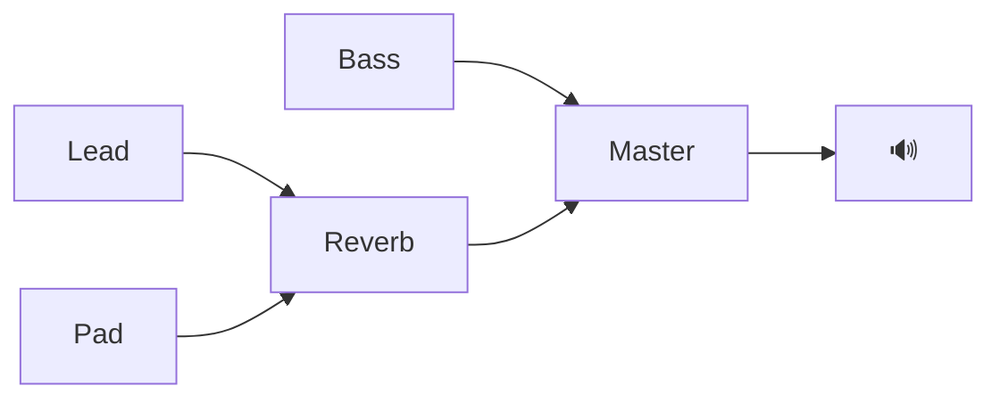

# Synthwave Surfer — Foundations Design (Phase 1)

> **Status:** Design — pending implementation plan
> **Date:** 2026-05-14
> **Scope:** Phase 1 of 4 (see Roadmap section)
> **Implementation target:** `synthwave_surfer.html` (single-file, ~1915 lines)

---

## 1. Vision & Context

### 1.1 The Kuro Universe

Synthwave Surfer is **the audio dimension of the Kuro ecosystem** — a designer-built Obsidian universe that already includes:

- **Kuro Theme** (v3.2.0) — visual language, ~6000 lines of CSS, signal subthemes via frontmatter
- **Kuro Companion Plugin** (v1.1.0) — aspect switcher, CRT effects, Hanko marker, retro 3D screensaver
- **Synthwave Surfer** (this project) — generative + curated synthwave music, designed to soundtrack the Kuro screensaver and other 3D animations
- **`.swmd` Codec** — a Markdown-native exchange format for music patterns, editable in Obsidian, didactically valuable for learning digital music production

The original spark: the Kuro screensaver gave off such strong synthwave vibes that it called for a matching soundtrack. The generative algorithm alone wasn't compelling enough, so the `.swmd` codec emerged as a way to combine algorithmic generation with curated, hand-composed patterns — and as a natural bridge to Obsidian.

### 1.2 What Phase 1 Solves

Three current frictions block Synthwave Surfer from delivering Carpenter-grade synthwave soundtracks:

| Friction | Phase 1 Fix |
|---|---|
| **Quality** — generative output sounds random | 6 curated multi-phase presets in `.swmd` format |
| **Length / Dramaturgy** — only 16-bar loops, no narrative | Phase system: one `.swmd` holds N phases, switchable live |
| **External control** — no API for animation/screensaver sync | `window.synthwaveSurfer.setPhase()` API surface |

Phase 1 does **not** ship full song-form composition or mood macros — those are Phase 3. Phase 1 lays the architectural foundation.

---

## 2. Roadmap

Phase 1 is the foundation. Phases 2–4 build on it. Each phase is a separate spec/plan cycle.

### Phase 1 — Foundations *(this document)*
- `.swmd` codec (parse + serialize)
- Phase system in pattern format
- 6 curated multi-phase presets
- Phase-transition API for external triggers
- WAV export fix + State JSON export
- **Stays in single-file HTML.** ~3-4 days.

### Phase 2 — Plugin Migration *(next)*
- New repo / vault location: `<vault>/.obsidian/plugins/synthwave-surfer/`
- Audio engine refactored to TypeScript Obsidian plugin
- `.swmd` files open in Obsidian with custom Pattern Editor view
- `swdrum` Markdown code-block renderer (interactive step sequencer in reading mode)
- Plugin events: `app.workspace.trigger('synthwave:phase-change', {phase})`
- HTML version remains as standalone "Composition Studio"
- **~1 week.**

### Phase 3 — Song-Form & Mood Control *(later)*
- Song-form sections: `## Section: intro|verse|chorus|bridge|drop|outro` with tension curves
- Mood macros (UI sliders): *Brooding ↔ Bright*, *Sparse ↔ Dense*, *Static ↔ Evolving*
- Phase auto-sequencing for 60–90s animation soundtracks (input: target duration → output: scripted phase progression)
- Solves the remaining Length and Mood-Control frictions completely.

### Phase 4 — Kuro Integration & Public Release *(future)*
- Kuro Companion listens to `synthwave:*` events; screensaver visuals sync with phase changes
- Pattern library with 30–50 curated patterns, organized as Genre Packs (Outrun, Noir, Dreamwave, Italo, Darksynth)
- Submission to Obsidian Community Plugin Marketplace
- Online demo (the standalone HTML) as "try before you install"

---

## 3. Phase 1 Architecture

### 3.1 Where Code Lives

All Phase 1 code stays in the single file `synthwave_surfer.html`. No build step. No npm. The plugin migration is Phase 2.

### 3.2 New Modules (logical, all in one file)

```
┌─────────────────────────────────────────────────────────────┐
│  synthwave_surfer.html                                      │
│                                                             │
│  ┌──────────────────┐    ┌──────────────────────────────┐   │
│  │  .swmd Codec     │    │  Phase Engine                │   │
│  │  - parser        │    │  - currentPhase: string      │   │
│  │  - serializer    │    │  - setPhase(name)            │   │
│  │  - validator     │    │  - crossfade scheduling      │   │
│  └────────┬─────────┘    └─────────┬────────────────────┘   │
│           │                        │                        │
│           ▼                        ▼                        │
│  ┌─────────────────────────────────────────────────────┐    │
│  │  generate() / scheduleAll() (existing, modified)    │    │
│  └─────────────────────────────────────────────────────┘    │
│                          │                                  │
│                          ▼                                  │
│  ┌─────────────────────────────────────────────────────┐    │
│  │  Tone.js Audio Graph (existing)                     │    │
│  └─────────────────────────────────────────────────────┘    │
│                                                             │
│  ┌─────────────────────────────────────────────────────┐    │
│  │  External API (window.synthwaveSurfer.*)            │    │
│  │  setPhase(name) | getPhases() | onPhaseChange(cb)   │    │
│  └─────────────────────────────────────────────────────┘    │
└─────────────────────────────────────────────────────────────┘
```

### 3.3 Data Flow (Fixed-Pattern Mode)

1. User picks a Factory Preset → `applyFactoryPreset()` parses embedded `.swmd` template literal → fills `currentSwmd` with `{meta, phases: [...]}`.
2. `currentSwmd.phases[currentPhaseIndex]` is the active phase. `generate()` builds a `form` object from this phase's bass/lead/pad/drums.
3. Tone.js loops the form. When `setPhase('intense')` fires, the engine schedules the switch at the next bar boundary (hard cut at bar — see §5.2).
4. External code (Kuro screensaver in Phase 4, or just a timer in Phase 1) calls `window.synthwaveSurfer.setPhase('drop')` to trigger transitions.

### 3.4 Generative Mode (preserved)

`patternMode === 'generative'` still uses the existing `algo.riffGen / leadGenA / leadGenB / buildForm` chain. No regression. The phase system is dormant in generative mode:
- `getPhases()` returns `[]`
- `getCurrentPhase()` returns `null`
- `setPhase(name)` returns `false` and logs a console warning
- `onPhaseChange(cb)` registers the callback but it never fires until fixed mode is active

---

## 4. `.swmd` Format Specification (v1.0, Phase-1 extension)

### 4.1 File Conventions

- **Codec name:** `.swmd` (Synthwave Markdown)
- **File extension on disk:** `.md` (so Obsidian opens them for editing)
- **Identification:** YAML frontmatter contains `synthwave-surfer: "1.0"`

### 4.2 Frontmatter (extended)

```yaml
---
synthwave-surfer: "1.0"
name: Miami Nights
algo: outrun
bpm: 120
mode: aeolian
pattern-mode: fixed
bass-root: 48      # MIDI note, C3
lead-root: 60      # MIDI note, C4
mood: nostalgic    # NEW: free-text tag, used as filter/metadata
energy: medium     # NEW: low | medium | high
default-phase: calm  # NEW: which phase plays first (defaults to first in file)
---
```

**New fields (Phase 1 introduces, Phase 3 consumes as UI controls):**
- `mood`: free-text mood tag (e.g. `brooding`, `nostalgic`, `dreamy`, `tense`)
- `energy`: enum `low | medium | high` (heuristic for filter UIs)
- `default-phase`: which phase to start with on load

### 4.3 Phases — Multi-Phase Pattern Sections

A `.swmd` file contains **one or more phases**. Each phase is its own complete arrangement (bass + lead + pad + drums). A phase is delimited by a level-2 heading of the form `## Phase: <name>`.

```markdown
## Phase: calm

### Bass · Stratos
[settings + pattern as in original spec]

### Lead · Crystal
[settings + pattern]

### Pad · Vapor
[settings + progression]

### Drums
[swdrum block]

## Phase: intense

### Bass · Stratos
[different pattern, possibly different settings]
...
```

**Backward compatibility with original spec:** A `.swmd` file without any `## Phase:` heading is treated as a single implicit phase named `default`. The original headings (`## Bass`, `## Lead`, etc.) at top level remain valid.

**Rules:**
- Each phase has its own Bass / Lead / Pad / Drums sections
- Phases share the file-level `bpm`, `mode`, `bass-root`, `lead-root` — no per-phase overrides in v1.0 (Phase 3 may add this)
- FX Bus and Routing are file-level (one per file, applies to all phases)

### 4.4 Per-Phase Section Structure

Each phase contains the same sections as a single-pattern `.swmd` from the original spec:

- `### Bass · <Model>` with `### Settings` + `### Pattern` (piano-roll table)
- `### Lead · <Model>` with `### Settings` + `### Pattern`
- `### Pad · <Model>` with `### Settings` + `### Progression`
- `### Drums` with `### Pattern` (swdrum code block)

The piano-roll encoding (`●` ON, `─` HOLD, blank rest) is unchanged from the original spec.

### 4.5 File-Level Sections (one per file)

After all phases:

- `## FX Bus` — reverb/delay/sidechain/tape-saturation/master settings
- `## Routing` — Mermaid diagram

### 4.6 Minimal Multi-Phase Example

````markdown
---
synthwave-surfer: "1.0"
name: Blade Runner Rain
algo: noir
bpm: 80
mode: aeolian
pattern-mode: fixed
bass-root: 48
lead-root: 60
mood: cinematic
energy: low
default-phase: calm
---

## Phase: calm

### Bass · Stratos
### Settings
| Param  | Value  |
|--------|--------|
| volume | 0.40   |

### Pattern
| Grad |  1 |  2 |  3 |  4 |  5 |  6 |  7 |  8 |  9 | 10 | 11 | 12 | 13 | 14 | 15 | 16 |
|------|----|----|----|----|----|----|----|----|----|----|----|----|----|----|----|----|
|  0   |  ● |  ─ |  ─ |  ─ |  ─ |  ─ |  ─ |  ─ |  ─ |  ─ |  ─ |  ─ |  ─ |  ─ |  ─ |  ─ |

[Lead, Pad, Drums sections...]

## Phase: rising

### Bass · Stratos
[denser pattern, same settings or modified]

[Lead, Pad, Drums sections...]

## FX Bus
| Effect    | Param | Value |
|-----------|-------|-------|
| reverb    | wet   | 0.60  |

## Routing

````

---

## 5. Phase Engine (state machine)

### 5.1 State

```javascript
let currentSwmd = null;        // parsed { meta, phases: [{name, bass, lead, pad, drums}], fxSettings }
let currentPhaseIndex = 0;     // index into currentSwmd.phases
let pendingPhaseChange = null; // { targetIndex, scheduledBarTime } — for queued transitions
const phaseChangeListeners = []; // callbacks registered via onPhaseChange
```

### 5.2 Transition Behavior

When `setPhase(name)` is called:
- If the target phase doesn't exist → log warning, no-op
- If `name === currentPhase` → no-op
- Otherwise → schedule the transition at the next bar boundary (the natural musical seam)
- Crossfade duration: 0 by default in v1.0 (hard cut at bar boundary). Phase 3 may add per-phase crossfade configuration.

### 5.3 Why "next bar" not "immediately"

Switching mid-bar would cause audible glitches and break the harmonic context (chord changes, drum fills are bar-aligned). Bar boundaries are the musical seam where transitions feel natural without crossfade. v1.0 keeps it simple; Phase 3 can add crossfade.

---

## 6. External API Surface

Exposed on `window.synthwaveSurfer` once the app initializes:

```typescript
window.synthwaveSurfer = {
  setPhase(name: string): boolean,        // returns true if scheduled, false if invalid
  getPhases(): string[],                  // names of available phases in current preset
  getCurrentPhase(): string | null,       // name of currently-playing phase
  onPhaseChange(cb: (phase: string) => void): () => void,  // returns unsubscribe fn
  getMeta(): { name, mood, energy, ... } | null,  // current preset metadata
}
```

### 6.1 Why `window.*` not a Module

Phase 1 is single-file HTML. No module system. `window.synthwaveSurfer` is the simplest cross-context API and works for both:
- Browser console testing (`window.synthwaveSurfer.setPhase('drop')`)
- Future iframe embedding (parent page can drive the synth)

Phase 2 (plugin) will replace this with proper Obsidian plugin API: `app.workspace.trigger('synthwave:phase-change', ...)` and exported plugin instance methods.

---

## 7. Curated Presets (Phase 1)

All 6 factory presets get embedded multi-phase `.swmd` template literals. Each preset has 2–3 phases. All in C aeolian (C minor) for harmonic consistency across phases.

| Preset | Algorithm | BPM | Phases |
|---|---|---|---|
| Miami Nights | outrun | 120 | `calm`, `pumping` |
| Highway Cruise | outrun | 108 | `cruising`, `breakdown`, `lift` |
| Blade Runner Rain | noir | 80 | `calm`, `rising`, `outro` |
| Carpenter Synth | noir | 90 | `tension`, `release` |
| Mall Bliss | dreamwave | 100 | `floating`, `arrival` |
| VHS Sunset | dreamwave | 96 | `glow`, `fade` |

Each phase is hand-composed with the design intent that all phases of a preset can transition to each other without harmonic clash (same key, compatible tessitura).

---

## 8. UI Changes

Minimal additions to keep Phase 1 fast. Major UI work is Phase 2/3.

### 8.1 New Buttons (Export panel)

- `⬇ SWMD` — export current state as `.swmd` (uses `swmdSerialize()`)
- `⬆ SWMD` — import a `.swmd` file (uses `swmdParse()`)
- `⬇ State JSON` — capture full state as JSON (existing fix from original plan)

### 8.2 Pattern Mode Toggle (Tracks panel)

- `⚙ Generativ / ⚙ Fixed` — switches between algorithmic generation and fixed-pattern playback (from original plan)

### 8.3 Phase Selector (NEW for Phase 1)

When `currentSwmd` has more than one phase, a small phase selector appears (e.g. dropdown or row of pill buttons). Selecting a phase calls `setPhase(name)`. The currently-playing phase is highlighted. Hidden when only one phase exists.

### 8.4 No Mood/Energy UI in Phase 1

The `mood` and `energy` frontmatter fields are stored and displayed read-only (e.g. as a small label near the preset name) but not yet user-editable controls. UI sliders come in Phase 3.

---

## 9. Out of Scope for Phase 1

Explicitly **not** in this phase, to keep scope tight:

- Plugin migration (Phase 2)
- Obsidian view registration / `swdrum` code-block renderer (Phase 2)
- Song-form sections (`## Section: intro/verse/...`) — distinct concept from phases (Phase 3)
- Mood macros as user-editable sliders (Phase 3)
- Tension-curve scheduling (Phase 3)
- Cross-phase crossfading (Phase 3 — Phase 1 is hard cut at bar boundary)
- Pattern library beyond 6 presets (Phase 4)
- Kuro Companion event integration (Phase 4)
- WAV cue-chunk markers for AE/DAW sync (Phase 3+)
- Polyphonic bass / lead patterns (would break the monophonic piano-roll grid)

---

## 10. Testing Strategy

Phase 1 is a single-file HTML app with audio side effects, so testing is mostly manual + smoke-level automated where possible.

### 10.1 Manual Verification Per Preset

For each of the 6 curated presets:
- [ ] Load preset → audio starts within 1 second
- [ ] Each phase plays (via Phase Selector UI) without audio glitches
- [ ] Phase transitions land on bar boundary, no out-of-key notes
- [ ] Export `.swmd` → re-import → produces same audio (round-trip integrity)
- [ ] WAV export produces a playable file matching the live audio

### 10.2 Codec Round-Trip Tests

A small inline test block (button-triggered, results in console):
- For each preset: `serialize → parse → serialize` must produce identical strings
- Malformed `.swmd` (missing frontmatter, broken phase header) → parser logs clear error, doesn't crash

### 10.3 API Smoke Test

```javascript
// Run in browser console after loading a multi-phase preset:
window.synthwaveSurfer.getPhases();         // → ["calm", "rising", "outro"]
window.synthwaveSurfer.getCurrentPhase();    // → "calm"
window.synthwaveSurfer.setPhase("rising");   // → true (scheduled)
// Wait for next bar → audio shifts to rising phase
window.synthwaveSurfer.getCurrentPhase();    // → "rising"
window.synthwaveSurfer.setPhase("nonexistent"); // → false, console.warn
```

### 10.4 Browser-Compat

Tested in Chrome/Firefox/Safari latest. Mobile is out of scope (Tone.js + Web Audio mobile is unreliable; explicit non-goal for Phase 1).

---

## 11. Risks & Open Questions

### 11.1 Risks

- **Phase transitions sound abrupt without crossfade.** Mitigation: bar-boundary alignment + same-key constraint should make this acceptable; Phase 3 adds proper crossfade if needed.
- **Multi-phase presets bloat the HTML file size.** Each preset's `.swmd` is ~2-3KB; 6 presets × 2-3 phases ≈ 30-50KB extra. Single-file stays under 200KB total. Acceptable.
- **`.swmd` serializer drift from parser.** Mitigation: round-trip tests in §10.2 catch this immediately.

### 11.2 Open Questions (non-blocking)

- Should phase transitions emit a sound effect (sweep, riser) by default? **Decision: no, keep it musical and clean. User can layer that themselves.**
- Should the FX Bus differ per phase? **Decision: no in v1.0, file-level only. Phase 3 may revisit.**
- Should the Phase Selector show energy/mood metadata per phase? **Decision: phase has only `name` in v1.0; metadata is at preset level. Keeps the format minimal.**

---

## 12. Success Criteria

Phase 1 is done when:

1. ✅ All 6 curated presets play with multi-phase content and sound musical (subjective, but clearly better than current generative output)
2. ✅ `.swmd` export → save → re-import → identical playback (round-trip works)
3. ✅ `window.synthwaveSurfer.setPhase()` works from browser console; transitions land on bar boundary
4. ✅ WAV export produces a playable file (fixes existing bug)
5. ✅ The codebase is structured so Phase 2 (plugin migration) is an extraction, not a rewrite

---

## 13. Relation to Existing Plan

The existing implementation plan at `docs/superpowers/plans/2026-05-14-swmd-codec-fixed-patterns.md` covers Tasks 1–12 of the **single-pattern** version of `.swmd`. Phase 1 of this design **supersedes** that plan with extensions:

- Original Task 1–9 (codec, parsers, UI buttons, generate() integration) → still applies, with parser extended for multi-phase
- Original Task 10 (curated patterns) → expanded from 1 pattern per preset to 2–3 phases per preset
- Original Task 11 (WAV fix) → unchanged
- Original Task 12 (State JSON export) → unchanged
- **NEW** in Phase 1: Phase Engine, External API, Phase Selector UI, mood/energy frontmatter fields

The new implementation plan (next step) will replace the old plan file.
